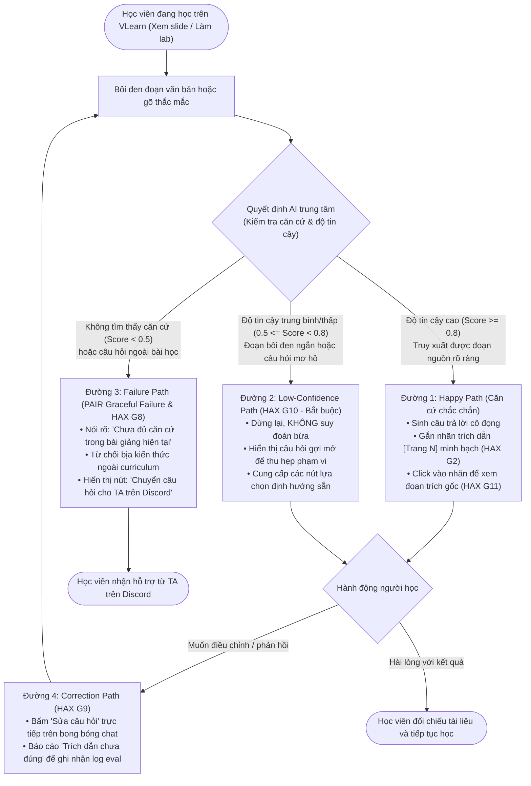

# Thiết kế Luồng Trải nghiệm & Bản mẫu Tương tác (CP2)

> **Mốc nộp:** CP2 · Cho thấy luồng hoạt động (Trước 21:00 17/9)  
> **Track:** A1 · Tối ưu VLearn AI Tutor (Grounding & Strict Citation Enforcement)  
> **Bản mẫu tương tác (Clickable Prototype):** Mở tệp [prototype/index.html](file:///d:/VInCode/K4-3B-Day05-06-AI-Product-Hackathon-main/prototype/index.html) trực tiếp trên bất kỳ trình duyệt nào.

---

## 1. Sơ đồ Luồng Trải nghiệm Toàn diện (User Journey & Decision Flow)

---

## 2. Phân tích Mức độ Tự động hóa theo Cost-of-Error (§2.3)

Nhóm xác định mức độ tự động hóa cho VLearn Tutor là **Conditional (Tự động có điều kiện)** dựa trên phân tích chi phí sai sót (*Cost-of-Error*):

| Tình huống | Mức xử lý | Hành vi hệ thống | Phân tích Cost-of-Error (Ai chịu gì? Sửa đắt hay rẻ?) |
|---|---|---|---|
| **Case chắc chắn (Có trích dẫn khớp slide/transcript)** | **Automate** | AI tự động trích xuất nguồn, sinh câu trả lời kèm huy hiệu trích dẫn `[Trang N]`. | • *Chi phí sai sót rất thấp:* Mọi thông tin đều gắn với số trang, học viên tự nhìn thấy và đối chiếu ngay. • *Sửa rẻ:* Học viên đọc đoạn trích dẫn là hiểu đúng ngay. |
| **Case mơ hồ / Thiếu thông tin (Bôi đen từ ngắn, hỏi chung chung)** | **Conditional (Thu hẹp)** | AI không tự trả lời ngay mà hỏi ngược lại 1 câu định hướng kèm các nút lựa chọn (HAX G10). | • *Chi phí sai sót trung bình:* Nếu AI tự đoán mò, câu trả lời sẽ lệch trình độ hoặc quá dài (>1.200 ký tự), làm gián đoạn việc nghe giảng. • *Sửa rẻ:* Học viên chỉ mất 1 click chọn đúng hướng mình cần. |
| **Case ngoài phạm vi / Không có nguồn trong bài** | **Augment / Chuyển người** | AI từ chối suy đoán ("Chưa đủ căn cứ"), hiển thị nút chuyển câu hỏi sang kênh `#ask-ta` Discord. | • *Chi phí sai sót CỰC ĐẮT:* Bịa kiến thức chuyên môn hoặc sai quy chế môn học làm học viên thi trượt, làm sai lab, mất điểm và mất niềm tin hoàn toàn vào nền tảng. • *Học viên và TA cùng chịu hậu quả nặng nề.* Do đó, AI **tuyệt đối không được tự động bịa**. |

---

## 3. Bốn Đường đi của Trải nghiệm (Thể hiện trên Prototype)

Mỗi đường đi đã được tích hợp thành một kịch bản demo (Scenario) có thể chuyển đổi bằng 1 click ngay trên thanh điều khiển của [prototype/index.html](file:///d:/VInCode/K4-3B-Day05-06-AI-Product-Hackathon-main/prototype/index.html):

### 1. Đường 1: Happy Path (AI tự tin cao — Có căn cứ xác thực)
- **Đầu vào:** Học viên bôi đen đoạn nói về *"Chi phí cuộc gọi API..."* ở Trang 7 và hỏi: *"Tại sao Output Token lại đắt hơn Input Token?"*
- **Quyết định AI:** `ANSWER_WITH_CITE`. Retrieval score cao, trích xuất chính xác slide Trang 7.
- **Kết quả:** Trả lời súc tích 2 nguyên nhân cốt lõi (Cơ chế Autoregressive và Bộ nhớ KV-Cache) kèm huy hiệu `[Trang 7]`.
- **Tương tác trực tiếp:** Học viên bấm vào huy hiệu `[Trang 7]` → Hệ thống hiển thị hộp popover trích dẫn nguyên văn slide để đối chiếu tức thì.

### 2. Đường 2: Low-Confidence Path (Lớp chỗ khó ② — Mơ hồ / Nghi ngờ)
- **Đầu vào:** Học viên chỉ bôi đen 1 từ duy nhất *"Tokens"* và hỏi cụt ngủn: *"Cái này dùng để làm gì?"*
- **Quyết định AI:** `CLARIFY`. Độ tin cậy thấp do từ khóa xuất hiện ở nhiều ngữ cảnh (cả khái niệm cơ bản và token economics).
- **Nguyên tắc HAX G10 áp dụng:** AI không độc thoại đoán mò mà hiển thị hộp thoại:  
  *"Đoạn bạn chọn ở [Trang 7] đề cập đến cả khái niệm Token và cách tính chi phí API. Để giải thích đúng trọng tâm, bạn muốn tìm hiểu phần nào?"*  
  Kèm 2 nút chọn:  
  👉 *1. Cách LLM phân rã từ thành Token (Định nghĩa cơ bản)*  
  👉 *2. Cách tính toán chi phí USD dựa trên Token (Token Economics)*
- **Kết quả:** Học viên bấm chọn nhánh mình cần và nhận câu trả lời chuẩn xác.

### 3. Đường 3: Failure / No-grounding Path (Lớp chỗ khó ① — Không có căn cứ / Ngoài bài học)
- **Đầu vào:** Học viên hỏi: *"Cho mình hỏi lịch nộp bài tập lớn của lớp và mã môn học là gì?"*
- **Quyết định AI:** `OUT_OF_SCOPE`. Không tìm thấy bất kỳ chunk nào trong slide/transcript Day 01 khớp với câu hỏi.
- **Nguyên tắc PAIR áp dụng (Graceful Failure & HAX G8):** AI thông báo thẳng thắn:  
  *"Rất tiếc, tài liệu bài giảng Day01 không chứa thông tin về lịch nộp bài tập lớn hay mã môn học. Mình chỉ giải đáp nội dung chuyên môn trong bài học."*  
  Đồng thời cung cấp đường lui: Nút bấm **"💬 Chuyển câu hỏi cho TA trên Discord"** và nút **"Bỏ qua & quay lại bài học"**.

### 4. Đường 4: Correction Path (Cơ chế người dùng sửa sai / phản hồi)
- **Đầu vào:** Học viên nhận được câu trả lời tóm tắt nhưng muốn làm sâu hơn hoặc nhận thấy câu hỏi trước đó chưa chuẩn.
- **Nguyên tắc HAX G9 áp dụng:** Dưới mỗi câu trả lời của Tutor đều có các hành động nhanh:
  - ✏️ **Sửa câu hỏi:** Tự động đưa con trỏ vào ô nhập liệu để học viên điều chỉnh câu hỏi mà không làm mất ngữ cảnh tài liệu đang chọn.
  - ⚠️ **Báo trích dẫn sai:** Cho phép học viên gắn cờ phản hồi nếu phát hiện trích dẫn chưa khớp, dữ liệu này lập tức được ghi nhận vào nhật ký kiểm định.

---

## 4. Bảng Ánh xạ Nguyên tắc HAX & PAIR vào Prototype

| Nguyên tắc | Tên gọi | Vị trí thể hiện cụ thể trong Prototype |
|---|---|---|
| **HAX G2** | Làm rõ hệ thống làm tốt đến đâu | Huy hiệu trích dẫn `[Trang N]` nổi bật màu xanh dương cạnh luận điểm, khẳng định thông tin đã được neo vào tài liệu chính thức. |
| **HAX G10** *(Bắt buộc)* | Thu hẹp phạm vi khi nghi ngờ | Hộp thoại gợi ý màu vàng (`.clarification-box`) hiển thị 2 lựa chọn nhánh tri thức khi câu hỏi mơ hồ, chặn đứng việc tutor tuôn bài giảng dài ngoài ý muốn. |
| **HAX G11** | Giải thích vì sao hệ thống làm vậy | Hộp Popover xem nguồn (`#citation-popover`): Click vào mã `[Trang N]` sẽ hiển thị đoạn trích dẫn nguyên văn từ slide/transcript gốc và tự động highlight trên trang bài học. |
| **HAX G9** | Cho phép chỉnh sửa dễ dàng | Nút "✏️ Sửa câu hỏi" gắn trực tiếp dưới chân từng tin nhắn trả lời (`.message-actions`), giúp học viên tinh chỉnh mà không bị đứt gãy luồng. |
| **HAX G8** | Gạt bỏ dễ dàng | Nút "Bỏ qua & quay lại bài học" cho phép người học đóng nhanh thông báo từ chối mà không bị chặn trải nghiệm đọc bài. |
| **PAIR** | Graceful Failure & Đường lui an toàn | Nút "💬 Chuyển câu hỏi cho TA trên Discord" tự động liên kết sang kênh hỗ trợ của lớp khi AI không tìm thấy căn cứ trong tài liệu. |

---

## 5. Hướng dẫn Trợ giảng (TA) Kiểm tra Nhanh trong 2 Phút

1. Mở tệp [prototype/index.html](file:///d:/VInCode/K4-3B-Day05-06-AI-Product-Hackathon-main/prototype/index.html) bằng Chrome / Edge / Firefox.
2. **Trải nghiệm Luồng Tuần tự (Sequential Walkthrough):**
   - Bấm nút **"Bước tiếp theo ➔"** ở góc phải trên cùng để tự động duyệt qua 4 bước của hành trình trải nghiệm.
   - Quan sát **khung Slide bên trái tự động trượt chuyển động mượt mà giữa 3 slide** (Trang 1 ➔ Trang 5 ➔ Trang 7) với hiệu ứng chuyển cảnh carousel và chấm chỉ thị trang.
3. **Thử nghiệm Tính năng Đổi trang tương tác theo Trích dẫn (Interactive Citation Movement):**
   - Click vào bất kỳ huy hiệu trích dẫn nào trong câu trả lời của Tutor (ví dụ click `[Trang 5]` hoặc `[Trang 7]`).
   - Khung slide sẽ **tự động trượt chuyển động tức thì đến đúng trang bài giảng tương ứng**, kích hoạt hiệu ứng highlight đoạn trích dẫn và mở hộp thoại xem nguồn nguyên văn (HAX G11).
4. **Kiểm tra 4 Nhánh Trải nghiệm:**
   - **Bước 1 (Happy Path):** Trả lời kèm trích dẫn `[Trang 7]`.
   - **Bước 2 (Kiểm chứng):** Slide trượt sang `[Trang 5]`, đối chiếu nội dung Transformer & Self-Attention.
   - **Bước 3 (Low-Confidence):** Hộp thoại HAX G10 hiển thị khi câu hỏi mơ hồ, cho chọn 1 trong 2 nhánh.
   - **Bước 4 (Từ chối ngoài bài):** PAIR Graceful Failure từ chối an toàn kèm nút chuyển sang Discord TA.
5. Toàn bộ luồng bấm thử được end-to-end, không cần cài đặt môi trường hay server.
